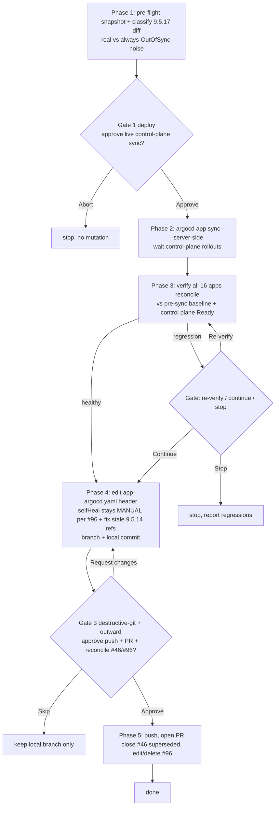

# argocd-selfmanage-reconcile — flow

```mermaid
flowchart TD
    P1[Phase 1: pre-flight snapshot + classify 9.5.17 diff<br/>real vs always-OutOfSync noise] --> G1{Gate 1 deploy<br/>approve live control-plane sync?}
    G1 -- Abort --> X1[stop, no mutation]
    G1 -- Approve --> P2[Phase 2: argocd app sync --server-side<br/>wait control-plane rollouts]
    P2 --> P3[Phase 3: verify all 16 apps reconcile<br/>vs pre-sync baseline + control plane Ready]
    P3 -->|healthy| P4
    P3 -->|regression| G2{Gate: re-verify / continue / stop}
    G2 -- Stop --> X2[stop, report regressions]
    G2 -- Re-verify --> P3
    G2 -- Continue --> P4[Phase 4: edit app-argocd.yaml header<br/>selfHeal stays MANUAL per #96 + fix stale 9.5.14 refs<br/>branch + local commit]
    P4 --> G3{Gate 3 destructive-git + outward<br/>approve push + PR + reconcile #46/#96?}
    G3 -- Request changes --> P4
    G3 -- Skip --> X3[keep local branch only]
    G3 -- Approve --> P5[Phase 5: push, open PR,<br/>close #46 superseded, edit/delete #96]
    P5 --> DONE[done]
```
