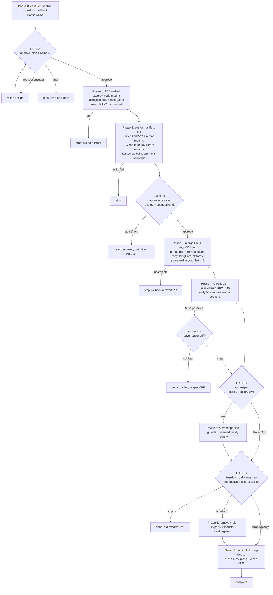

# #195 — Unify NFS export to unblock Cleanuparr unlinked reaper

```mermaid
flowchart TD
    A[Phase 0: capture baseline + design + rollback<br/>READ-ONLY] --> GA{GATE A<br/>approve plan + rollback}
    GA -->|request changes| AR[refine design] --> GA
    GA -->|abort| STOP0[stop: read-only only]
    GA -->|approve| B[Phase 1: ADD unified export + node mounts<br/>alongside old, health-gated<br/>prove nlink=2 on new path]
    B -->|fail| STOP1[stop: old path intact]
    B --> C[Phase 2: author manifest PR<br/>unified PV/PVC + remap mounts<br/>+ Cleanuparr RO library mounts<br/>kustomize build, open PR no-merge]
    C -->|build fail| STOP2[stop]
    C --> GB{GATE B<br/>approve cutover<br/>deploy + destructive-git}
    GB -->|abort/hold| STOP3[stop: recovery path live, PR open]
    GB -->|approve| D[Phase 3: merge PR -> ArgoCD sync<br/>remap qbt + arr root folders<br/>copyUsingHardlinks=true<br/>prove real import nlink>=2]
    D -->|incomplete| STOP4[stop: rollback = revert PR]
    D --> E[Phase 4: Cleanuparr unlinked rule DRY-RUN<br/>verify 0 false positives vs seeders]
    E -->|false positives| GFP{re-check or<br/>leave reaper OFF}
    GFP -->|still bad| STOP5[done: unified, reaper OFF]
    E --> GC{GATE C<br/>arm reaper<br/>deploy + destructive}
    GFP -->|clean| GC
    GC -->|leave OFF| GD
    GC -->|arm| F[Phase 5: ARM reaper live<br/>guards preserved, verify healthy]
    F --> GD{GATE D<br/>teardown old + wrap-up<br/>destructive + destructive-git}
    GD -->|stop| STOP6[done: old exports kept]
    GD -->|teardown| G[Phase 6: remove 4 old exports + mounts<br/>health-gated]
    GD -->|wrap-up only| H
    G --> H[Phase 7: docs + follow-up issues<br/>run PR test plans + close #195]
    H --> DONE[complete]
```
