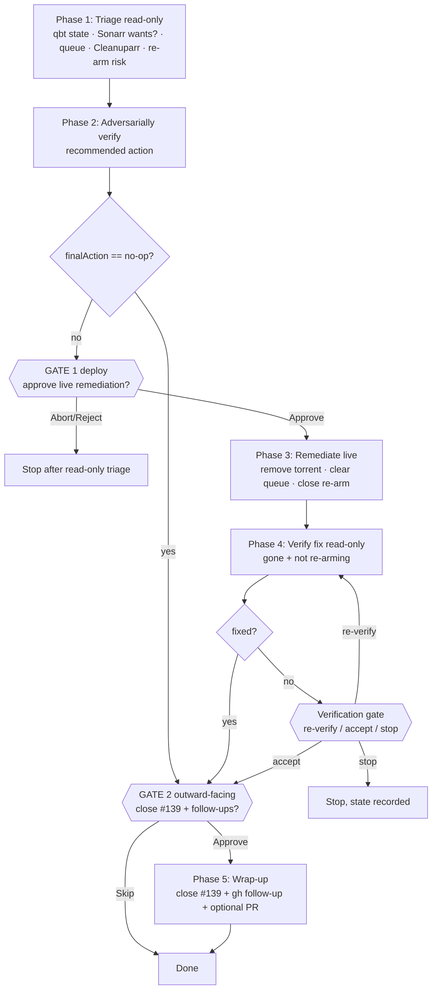

# cleanuparr-s04e07-triage

Triage + remediation for the stalled Sonarr seriesId 40 S04E07 torrent (hash `828ea9eb…`, `stalledDL`) — issue #139.

## Gates (breakpointTolerance = low / expert)

- **GATE 1 — deploy**: mandatory before any live mutation of qbittorrent / Sonarr (remove download, clear queue, unmonitor/blocklist). Skipped only when the verified action is `no-op`.
- **GATE 2 — outward-facing**: mandatory before closing issue #139 and opening any gh follow-up / doc / git change.
- **Verification gate**: only if post-remediation verify fails (re-verify / accept / stop).

All other steps are read-only investigation or the single approved live change — no extra breakpoints, per the user's low tolerance.
