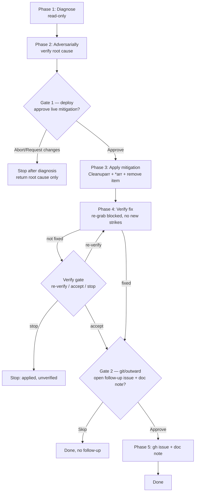

# Cleanuparr strike-runaway — flow

```mermaid
flowchart TD
  A[Phase 1: Diagnose<br/>read-only] --> B[Phase 2: Adversarially<br/>verify root cause]
  B --> G1{Gate 1 — deploy<br/>approve live mitigation?}
  G1 -- Abort/Request changes --> X[Stop after diagnosis<br/>return root cause only]
  G1 -- Approve --> C[Phase 3: Apply mitigation<br/>Cleanuparr + *arr + remove item]
  C --> D[Phase 4: Verify fix<br/>re-grab blocked, no new strikes]
  D -- not fixed --> GV{Verify gate<br/>re-verify / accept / stop}
  GV -- re-verify --> D
  GV -- stop --> Y[Stop: applied, unverified]
  GV -- accept --> G2
  D -- fixed --> G2{Gate 2 — git/outward<br/>open follow-up issue + doc note?}
  G2 -- Skip --> Z[Done, no follow-up]
  G2 -- Approve --> E[Phase 5: gh issue + doc note]
  E --> Z2[Done]
```
