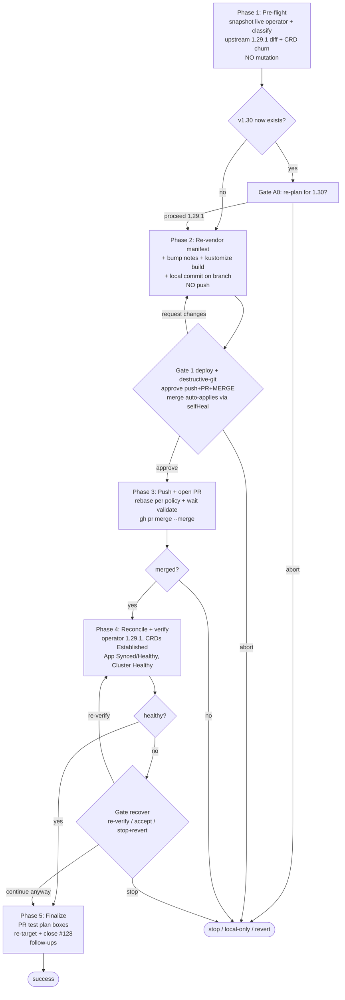

# CNPG operator bump v1.28.0 → v1.29.1 (issue #128, re-targeted)

**Key facts**
- CNPG **1.30 does not exist** (latest stable v1.29.1, 2026-05-08). Issue re-targeted to v1.29.1.
- `cnpg-operator` ArgoCD App is **selfHeal ON + ServerSideApply** (#127 merged) → **merge = deploy**.
- Risk = CRD schema churn 1.28→1.29; rollback = revert the merge PR.
- Gates calibrated to low breakpoint tolerance: break only on deploy / destructive-git / regression.
