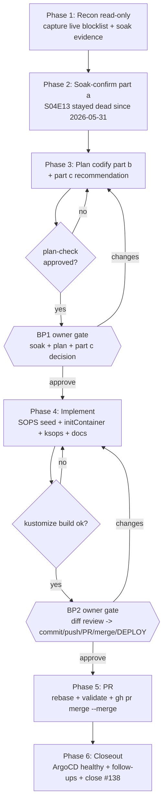

# Deliver issue #138 — Cleanuparr blocklist durability + soak-confirm

- **BP1** (architecture-change gate): approve soak interpretation + codify plan, decide part (c).
- **BP2** (deploy + secrets-rotation + destructive-git gate): review exact diff, authorize commit→merge→ArgoCD deploy.
