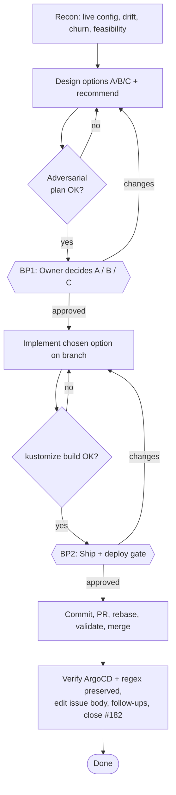

# Flow — deliver issue #182

```mermaid
flowchart TD
  recon[Recon: live config, drift, churn, feasibility] --> plan[Design options A/B/C + recommend]
  plan --> check{Adversarial<br/>plan OK?}
  check -- no --> plan
  check -- yes --> bp1{{BP1: Owner decides A / B / C}}
  bp1 -- changes --> plan
  bp1 -- approved --> impl[Implement chosen option on branch]
  impl --> build{kustomize build OK?}
  build -- no --> impl
  build -- yes --> bp2{{BP2: Ship + deploy gate}}
  bp2 -- changes --> impl
  bp2 -- approved --> pr[Commit, PR, rebase, validate, merge]
  pr --> closeout[Verify ArgoCD + regex preserved,<br/>edit issue body, follow-ups, close #182]
  closeout --> done([Done])
```
