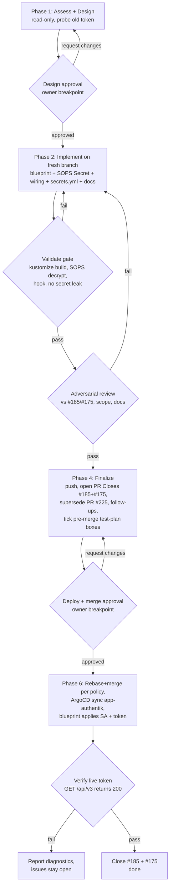

# Issue #185 — Durable Authentik service-account token (process map)

Best-for-services delivery: a declarative, GitOps-managed machine identity (Authentik
blueprint + SOPS non-expiring token) that replaces ad-hoc personal tokens. Folds in #175
(retire the personal superuser token) and supersedes the contradictory PR #225. Two owner
gates: **design approval** and **deploy/merge** (alwaysBreakOn: deploy, destructive-git).

## Quality gates & loops
- **Validate** (Phase 2): repo's own checks — `kustomize build --enable-helm --enable-alpha-plugins --enable-exec`, `sops -d`, `check-sops-encrypted.sh`, secret-leak scan. Loops back to Implement.
- **Review** (Phase 3): adversarial correctness vs #185 + #175, blueprint schema, wiring, docs consistency, no leak. Loops back to Implement.
- **Verify** (Phase 6): live token authenticates against `/api/v3/`; issues only close on success.

## Owner breakpoints
1. **Design approval** — architecture + secrets decision; confirms mechanism, scope, and PR #225 supersession.
2. **Deploy + merge** — merges to main and changes live Authentik state (new service-account user + non-expiring token).
