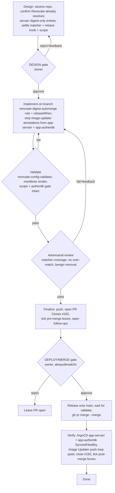

# Deliver issue #192 — Renovate digest consolidation

```mermaid
flowchart TD
    A[Design: assess repo, confirm Renovate already resolves<br/>servarr digest-only entries, settle matcher + rebase knob + scope] --> B{DESIGN gate<br/>owner}
    B -- reject+feedback --> A
    B -- approve --> C[Implement on branch:<br/>renovate digest-automerge rule + rebaseWhen,<br/>strip image-updater annotations from app-servarr + app-authentik]
    C --> D{Validate<br/>renovate-config-validator, manifests render,<br/>scope + authentik gate intact}
    D -- fail --> C
    D -- pass --> E{Adversarial review<br/>matcher coverage, no over-match, benign removal}
    E -- fail+feedback --> C
    E -- pass --> F[Finalize: push, open PR Closes #192,<br/>tick pre-merge boxes, open follow-ups]
    F --> G{DEPLOY/MERGE gate<br/>owner, alwaysBreakOn}
    G -- reject --> H[Leave PR open]
    G -- approve --> I[Rebase onto main, wait for validate,<br/>gh pr merge --merge]
    I --> J[Verify: ArgoCD app-servarr + app-authentik Synced/Healthy,<br/>Image Updater push loop quiet, close #192, tick post-merge boxes]
    J --> K[Done]
```
