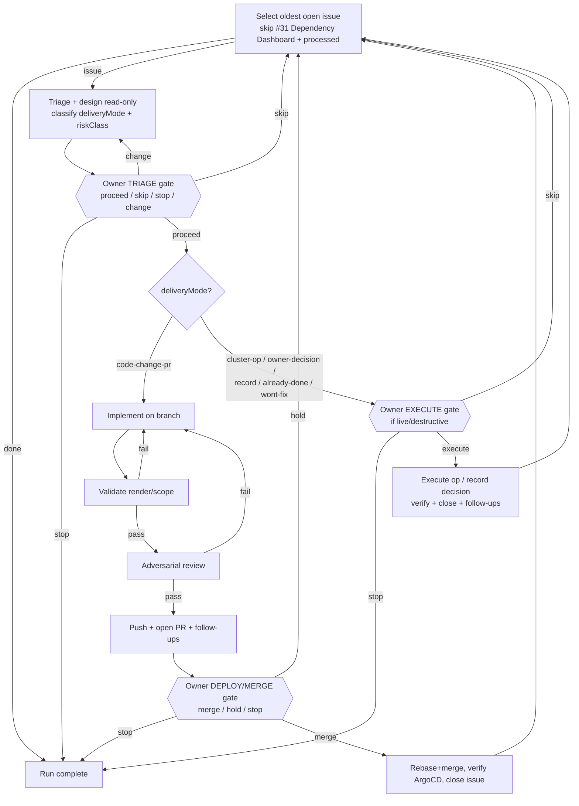

# Deliver open issues — oldest first (loop)

Two human gates per delivered issue (triage/approach + deploy/execute), matching the
profile `breakpointTolerance=low`, `alwaysBreakOn=[destructive-git, deploy]`. Everything
between the gates (analysis, branch edits, validate, review, PR authoring) is autonomous.
