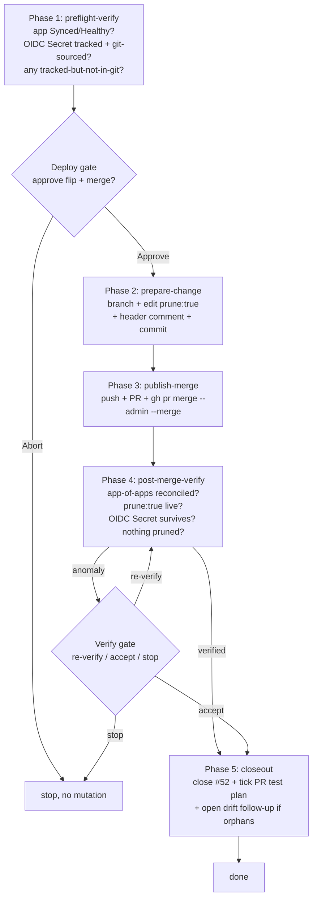

# filebrowser prune flip (#52) — process flow

```mermaid
flowchart TD
  A[Phase 1: preflight-verify<br/>app Synced/Healthy?<br/>OIDC Secret tracked + git-sourced?<br/>any tracked-but-not-in-git?] --> G1{Deploy gate<br/>approve flip + merge?}
  G1 -- Abort --> X[stop, no mutation]
  G1 -- Approve --> B[Phase 2: prepare-change<br/>branch + edit prune:true<br/>+ header comment + commit]
  B --> C[Phase 3: publish-merge<br/>push + PR + gh pr merge --admin --merge]
  C --> D[Phase 4: post-merge-verify<br/>app-of-apps reconciled?<br/>prune:true live?<br/>OIDC Secret survives? nothing pruned?]
  D -- anomaly --> G2{Verify gate<br/>re-verify / accept / stop}
  D -- verified --> E[Phase 5: closeout<br/>close #52 + tick PR test plan<br/>+ open drift follow-up if orphans]
  G2 -- re-verify --> D
  G2 -- stop --> X
  G2 -- accept --> E
  E --> Z[done]
```
