# huntarr → newtarr migration (#131) — flow

```mermaid
flowchart TD
    start([Start #131]) --> discover[1. discover-runtime<br/>git + live k8s + Authentik + DNS inventory]
    discover --> plan[2. plan-migration]
    plan --> bpPlan{BP: approve plan?}
    bpPlan -->|request changes| plan
    bpPlan -->|abort| stop1([abort])
    bpPlan -->|approve| author[3. author-manifests<br/>rename dir+manifest+image+image-updater+docs<br/>kustomize build · branch + local commit]
    author --> bpDeploy{BP: deploy + merge?}
    bpDeploy -->|abort| stop2([branch local only])
    bpDeploy -->|approve| merge[4. publish-merge<br/>push · PR · rebase · validate · merge]
    merge -->|merged| bpCopy{BP: config copy<br/>DESTRUCTIVE}
    merge -->|failed| stop3([merge-failed])
    bpCopy -->|skip| authStep
    bpCopy -->|abort| stop4([abort])
    bpCopy -->|approve| copy[5. config-data-migration<br/>quiesce newtarr · copy SQLite · restore]
    copy --> bpAuth{BP: Authentik<br/>SSO/secrets}
    authStep --> bpAuth
    bpAuth -->|approve| authk[6. authentik-migrate<br/>recreate app/provider · rebind · delete huntarr]
    bpAuth -->|skip| bpDns
    bpAuth -->|abort| stop5([abort])
    authk --> bpDns{BP: DNS cutover}
    bpDns -->|approve| dns[7. dns-cutover<br/>Pi-hole dnsmasq + Cloudflare shadow]
    bpDns -->|skip| bpClean
    bpDns -->|abort| stop6([abort])
    dns --> bpClean{BP: delete old huntarr<br/>DESTRUCTIVE}
    bpClean -->|approve| clean[8. cleanup-old-huntarr<br/>delete orphan deploy/svc/pdb/PVC]
    bpClean -->|skip| verify
    clean --> verify[9. verify-work<br/>healthy · SSO · config carried<br/>ZERO leftovers: git/live/authentik/dns]
    verify -->|verified| close[10. closeout<br/>close #131 · tick PR · follow-ups]
    verify -->|issues| bpVerify{BP: re-verify / accept / stop}
    bpVerify -->|re-verify| verify
    bpVerify -->|accept| close
    bpVerify -->|stop| stop7([verification-stop])
    close --> done([Done])
```

**Safe ordering:** old huntarr keeps serving until the very end. Merge → ArgoCD
creates newtarr + empty PVC → copy config → migrate Authentik → cut DNS → only
then delete old huntarr.

**Breakpoints** (low tolerance / alwaysBreakOn destructive+deploy+secrets): plan,
deploy/merge, config-copy, Authentik, DNS, delete-old, verify-anomaly.
