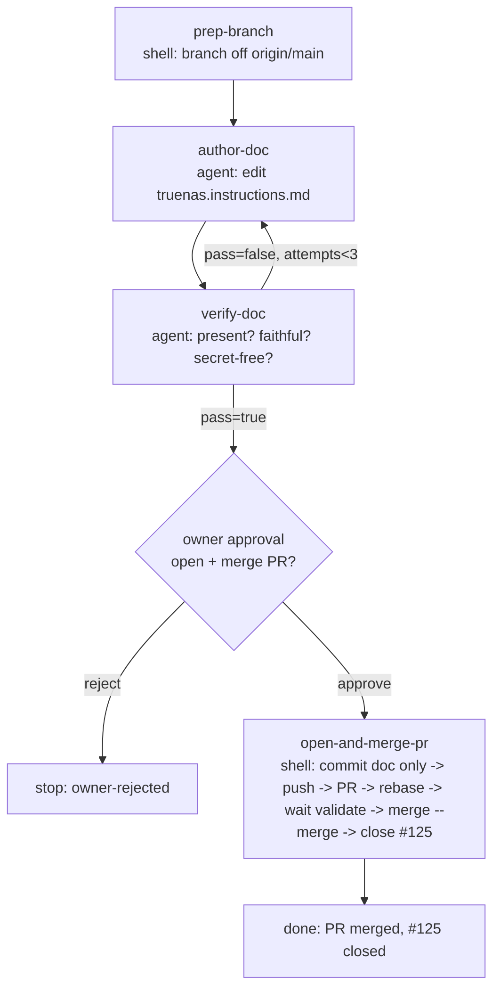

# issue-125-midclt-doc — flow

```mermaid
flowchart TD
    A[prep-branch<br/>shell: branch off origin/main] --> B[author-doc<br/>agent: edit truenas.instructions.md]
    B --> C[verify-doc<br/>agent: present? faithful? secret-free?]
    C -->|pass=false, attempts<3| B
    C -->|pass=true| D{owner approval<br/>open + merge PR?}
    D -->|reject| X[stop: owner-rejected]
    D -->|approve| E[open-and-merge-pr<br/>shell: commit doc only -> push -> PR -> rebase -> wait validate -> merge --merge -> close #125]
    E --> F[done: PR merged, #125 closed]
```
