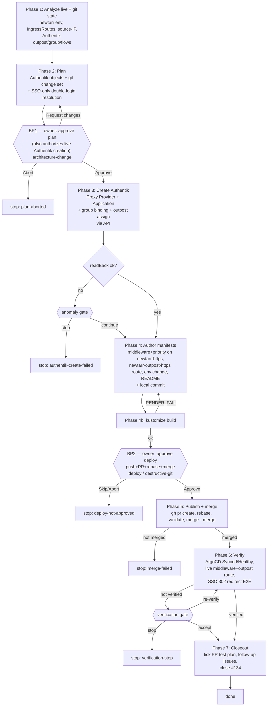

# Issue #134 — newtarr Authentik SSO (Option B, SSO-only)

**Order rationale:** Authentik objects are created *before* the git merge so the embedded
outpost already has a provider for `newtarr.epaflix.com` when Traefik forward-auth goes live —
otherwise authenticated requests would 400 / redirect-loop.
