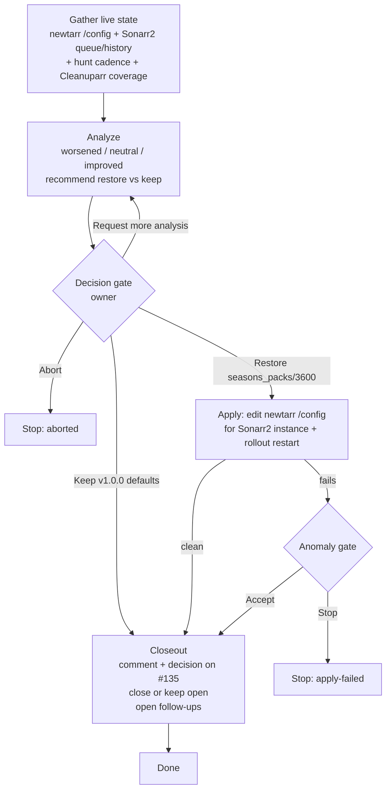

# Flow — Issue #135 Sonarr2 hunt behaviour

```mermaid
flowchart TD
    A[Gather live state\nnewtarr /config + Sonarr2 queue/history\n+ hunt cadence + Cleanuparr coverage] --> B[Analyze\nworsened / neutral / improved\nrecommend restore vs keep]
    B --> G{Decision gate\nowner}
    G -- Request more analysis --> B
    G -- Abort --> X[Stop: aborted]
    G -- Keep v1.0.0 defaults --> C[Closeout]
    G -- Restore seasons_packs/3600 --> AP[Apply: edit newtarr /config\nfor Sonarr2 instance + rollout restart]
    AP -->|clean| C
    AP -->|fails| AN{Anomaly gate}
    AN -- Accept --> C
    AN -- Stop --> Y[Stop: apply-failed]
    C[Closeout\ncomment + decision on #135\nclose or keep open\nopen follow-ups] --> Z[Done]
```
