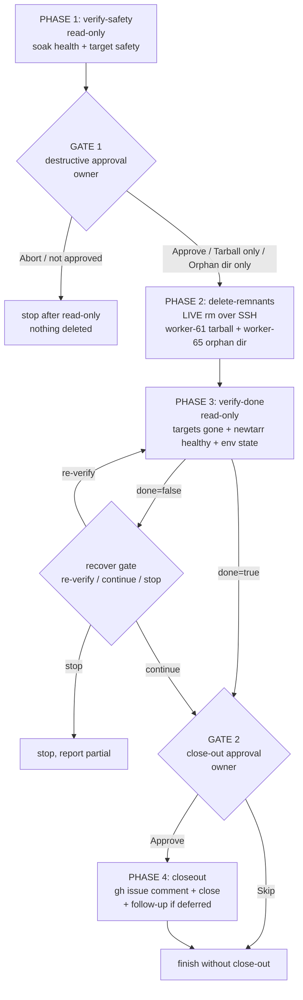

# Issue #136 — huntarr→newtarr post-migration tidy-up

## Gates
- **GATE 1 (destructive)** — fires only after read-only proof that newtarr soak is good and both targets are orphaned/safe. Options: Approve / Tarball only / Orphan dir only / Abort.
- **GATE 2 (outward-facing)** — approve closing issue #136 + opening any follow-up.

The newtarr pod is never restarted — stale `HUNTARR_*` env is inert and clears on its own next restart (owner decision: verification only).
