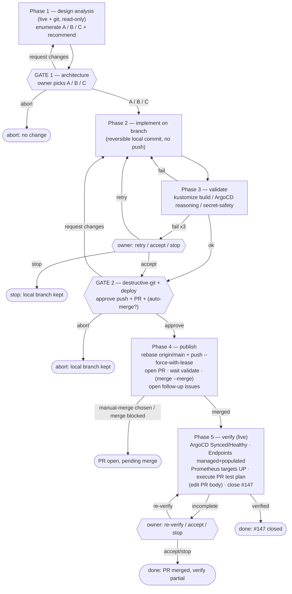

# Issue #147 — control-plane Endpoints GitOps durability

**alwaysBreakOn gates (low breakpoint tolerance):** architecture-change (Gate 1), destructive-git + deploy (Gate 2). Verification gates only fire on failure.
