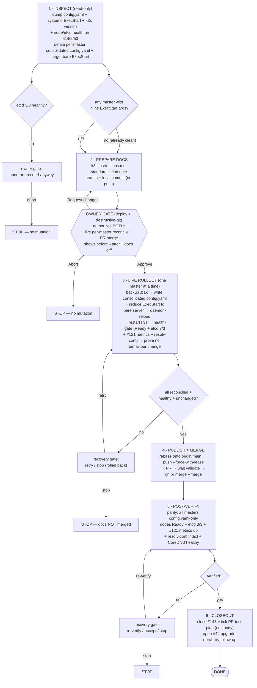

# Issue #148 — Standardize k3s masters on `/etc/rancher/k3s/config.yaml`

**Safety:** etcd quorum is 2/3 — masters are reconciled **one at a time**, never two restarts at once. Every change is a **pure refactor** (where args live, not what they are): config.yaml + systemd unit are backed up to `.bak-148` and **rolled back automatically** if a master does not return healthy. The single owner gate covers the live control-plane restart **and** the docs PR merge (low breakpoint tolerance; `alwaysBreakOn: deploy, destructive-git`).
