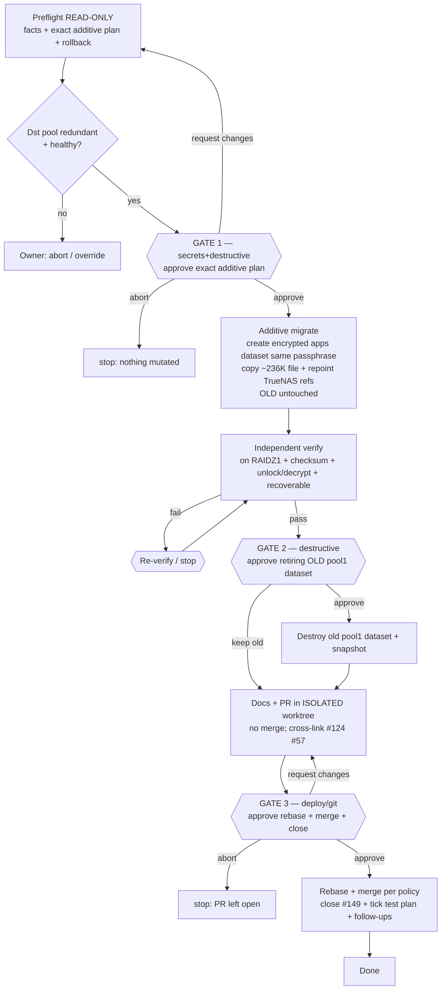

# Issue #149 — Make the SOPS master age-key backup redundant (Option C)

Move `pool1/encrypted-backups` (non-redundant stripe) → `apps/encrypted-backups` (RAIDZ1, redundant).
Additive-first: create + copy + verify **before** anything is destroyed. Three owner gates.

**Why Option C:** no spare disks exist (A/B need new 10TB+14TB hardware); payload is only ~236K;
`apps` is already RAIDZ1-redundant with ~230G free; the age key keeps two independent copies
(workstation + in-cluster KSOPS) so relocating this tertiary copy is low-risk.
