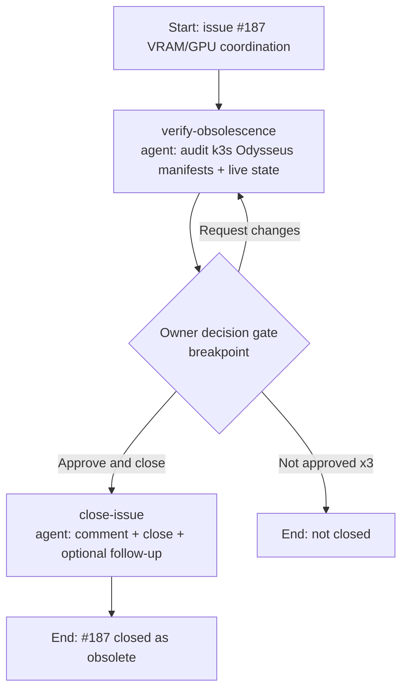

# Issue #187 obsolescence — process flow

## Steps
1. **verify-obsolescence** — Confirm against git manifests + live cluster that the k3s Odysseus
   Deployment has no GPU, no `NVIDIA_*` env, and serves LLM/embeddings only via remote Ollama
   (`192.168.10.200:30068`). Conclude the VRAM-contention premise is dead. Draft closing comment;
   propose a follow-up only if a genuine non-duplicate residual concern exists.
2. **Owner decision gate** (breakpoint) — Present recommendation + closing comment; retry/refine on
   rejection (up to 3 attempts).
3. **close-issue** — Post the approved comment, close #187 as "not planned", open + cross-link any
   approved follow-up. No git changes.
