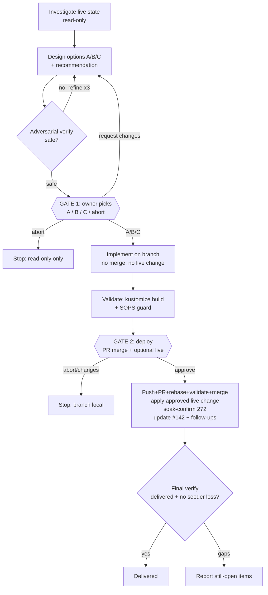

# Issue #142 orphan-reaping delivery — flow

```mermaid
flowchart TD
    A[Investigate live state<br/>read-only] --> B[Design options A/B/C<br/>+ recommendation]
    B --> C{Adversarial verify<br/>safe?}
    C -->|no, refine x3| B
    C -->|safe| G1{{GATE 1: owner picks<br/>A / B / C / abort}}
    G1 -->|request changes| B
    G1 -->|abort| X1[Stop: read-only only]
    G1 -->|A/B/C| D[Implement on branch<br/>no merge, no live change]
    D --> E[Validate: kustomize build<br/>+ SOPS guard]
    E --> G2{{GATE 2: deploy<br/>PR merge + optional live}}
    G2 -->|abort/changes| X2[Stop: branch local]
    G2 -->|approve| F[Push+PR+rebase+validate+merge<br/>apply approved live change<br/>soak-confirm 272<br/>update #142 + follow-ups]
    F --> V{Final verify<br/>delivered + no seeder loss?}
    V -->|yes| DONE[Delivered]
    V -->|gaps| OPEN[Report still-open items]
```

Unlinked/orphan rule stays OFF unless **Option A** (library roots mounted) lands.
