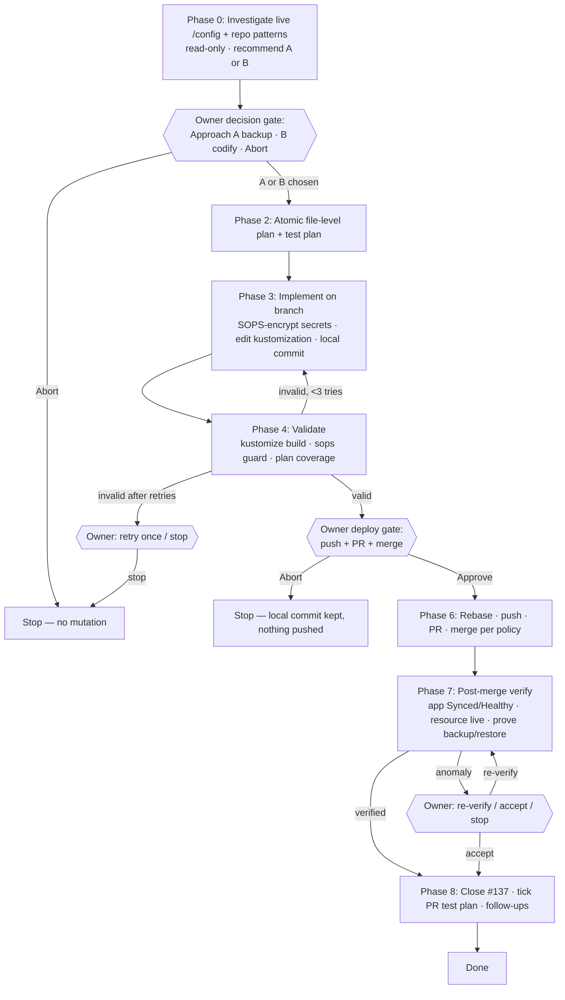

# newtarr config codify/backup (#137) — flow

```mermaid
flowchart TD
  A[Phase 0: Investigate live /config + repo patterns<br/>read-only · recommend A or B] --> G1{{Owner decision gate:<br/>Approach A backup · B codify · Abort}}
  G1 -->|Abort| X[Stop — no mutation]
  G1 -->|A or B chosen| P[Phase 2: Atomic file-level plan + test plan]
  P --> I[Phase 3: Implement on branch<br/>SOPS-encrypt secrets · edit kustomization · local commit]
  I --> V[Phase 4: Validate<br/>kustomize build · sops guard · plan coverage]
  V -->|invalid, <3 tries| I
  V -->|invalid after retries| G1b{{Owner: retry once / stop}}
  G1b -->|stop| X
  V -->|valid| G2{{Owner deploy gate:<br/>push + PR + merge}}
  G2 -->|Abort| X2[Stop — local commit kept, nothing pushed]
  G2 -->|Approve| M[Phase 6: Rebase · push · PR · merge per policy]
  M --> PV[Phase 7: Post-merge verify<br/>app Synced/Healthy · resource live · prove backup/restore]
  PV -->|anomaly| G3{{Owner: re-verify / accept / stop}}
  PV -->|verified| C[Phase 8: Close #137 · tick PR test plan · follow-ups]
  G3 -->|re-verify| PV
  G3 -->|accept| C
  C --> DONE[Done]
```
