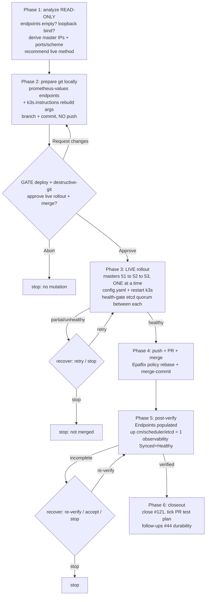

# #121 — k3s control-plane metrics: flow

Order rationale: LIVE bind-address change goes FIRST so the metrics ports already answer before
the git endpoints change merges and Prometheus begins scraping them.
