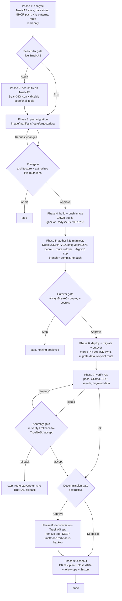

# Odysseus TrueNAS → k3s migration — flow

Breakpoints (owner; alwaysBreakOn deploy+destructive+architecture+secrets):
1. **Search-fix gate** — apply the live fix on TrueNAS now (quick win).
2. **Plan gate** — architecture; approval authorizes GHCR push + GitOps merge + k3s deploy + data migration + route cutover + (later) decommission.
3. **Cutover gate** — merge + deploy + migrate + re-point the route to k3s (TrueNAS kept as fallback).
4. **Decommission gate** — destructive; remove the TrueNAS app, keep the dataset as backup.
Plus a conditional verify/anomaly gate (re-verify / roll back to TrueNAS / accept).
