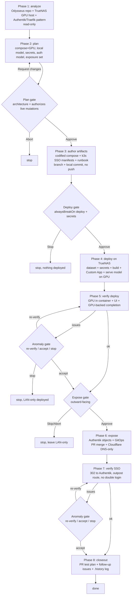

# Odysseus TrueNAS GPU deploy — flow

Breakpoints (owner, low tolerance / alwaysBreakOn deploy+architecture+secrets):
1. **Plan gate** — architecture review; approval authorizes all later live mutations.
2. **Deploy gate** — build + Custom App create + serve model on the GPU (no public exposure yet).
3. **Expose gate** — Authentik objects + GitOps merge + Cloudflare record (outward-facing).
Plus two conditional anomaly/re-verify gates after the deploy and SSO verifications.
