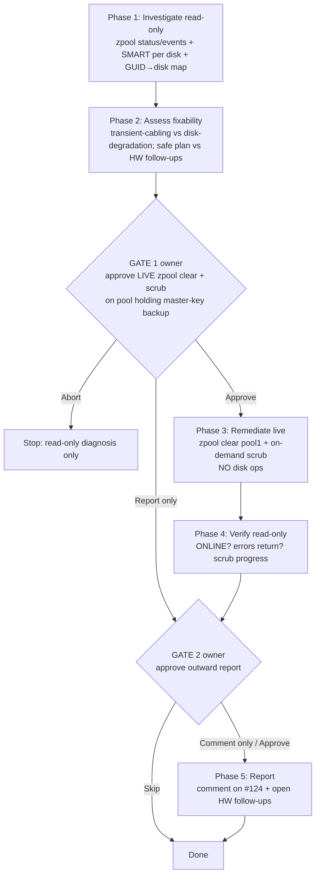

# pool1-degraded-remediation

```mermaid
flowchart TD
    A[Phase 1: Investigate read-only<br/>zpool status/events + SMART per disk + GUID→disk map] --> B[Phase 2: Assess fixability<br/>transient-cabling vs disk-degradation; safe plan vs HW follow-ups]
    B --> G1{GATE 1 owner<br/>approve LIVE zpool clear + scrub<br/>on pool holding master-key backup}
    G1 -->|Abort| X[Stop: read-only diagnosis only]
    G1 -->|Report only| R
    G1 -->|Approve| C[Phase 3: Remediate live<br/>zpool clear pool1 + on-demand scrub<br/>NO disk ops]
    C --> D[Phase 4: Verify read-only<br/>ONLINE? errors return? scrub progress]
    D --> R{GATE 2 owner<br/>approve outward report}
    R -->|Skip| Z[Done]
    R -->|Comment only / Approve| E[Phase 5: Report<br/>comment on #124 + open HW follow-ups]
    E --> Z[Done]
```
