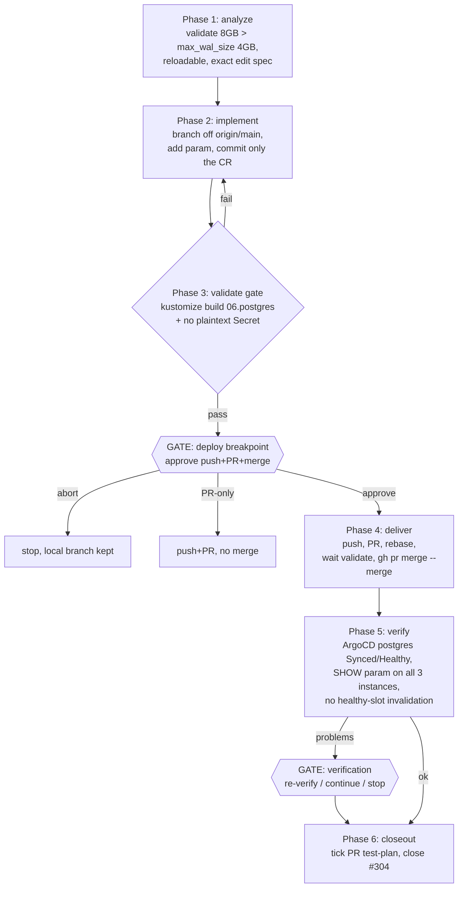

# Deliver issue #304 — bound max_slot_wal_keep_size on CNPG

- **Breakpoints (low tolerance):** one mandatory **deploy** gate before push/merge; one conditional verification gate only if live verify fails.
- **Risk:** merge→main triggers ArgoCD selfHeal sync of live Postgres config. Param is reloadable → no failover.
