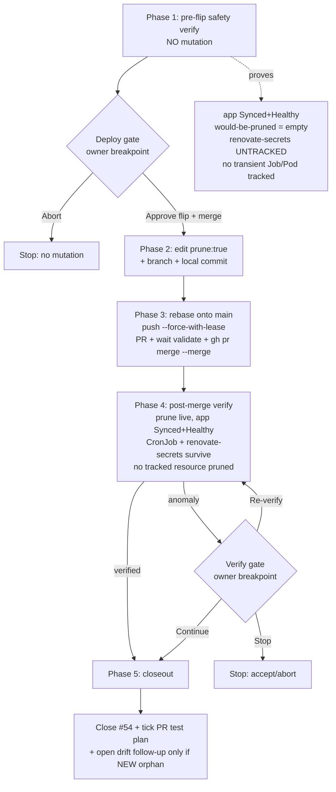

# renovate-prune-flip — flow

Resolve Epaflix issue **#54** (last of the 5 split prune-flips): flip the `renovate`
ArgoCD Application `prune:false → prune:true` after its overdue 48h soak.

## Safety model
- **Deploy is gated** by a mandatory owner breakpoint (profile `alwaysBreakOn: deploy`).
- The renovate app tracks only `{Namespace, ServiceAccount, CronJob}` → prune surface is tiny.
- `renovate-secrets` (imperative GitHub PAT, out of git) must be **untracked** so prune ignores it — verified before AND after.
- CronJob Jobs/Pods are owner-referenced → not ArgoCD-tracked → prune leaves them alone.
- Merge is the deploy: app-of-apps (#48 closed) selfHeal reconciles the new spec — no manual `kubectl apply`.
