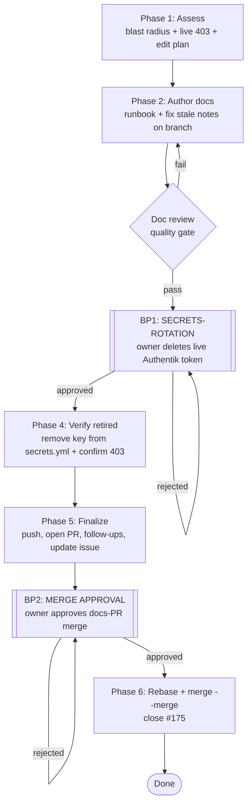

# Rotate (revoke & retire) Authentik admin API token — #175

```mermaid
flowchart TD
    A[Phase 1: Assess<br/>blast radius + live 403 + edit plan] --> B[Phase 2: Author docs<br/>runbook + fix stale notes on branch]
    B --> C{Doc review<br/>quality gate}
    C -- fail --> B
    C -- pass --> D[[BP1: SECRETS-ROTATION<br/>owner deletes live Authentik token]]
    D -- rejected --> D
    D -- approved --> E[Phase 4: Verify retired<br/>remove key from secrets.yml + confirm 403]
    E --> F[Phase 5: Finalize<br/>push, open PR, follow-ups, update issue]
    F --> G[[BP2: MERGE APPROVAL<br/>owner approves docs-PR merge]]
    G -- rejected --> G
    G -- approved --> H[Phase 6: Rebase + merge --merge<br/>close #175]
    H --> I([Done])
```
