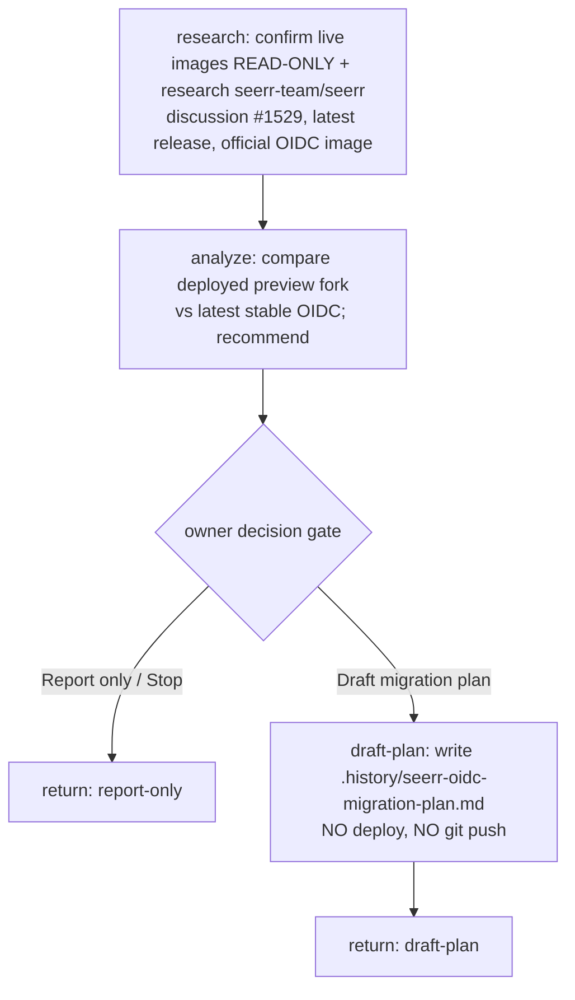

# seerr OIDC research — flow

- **No cluster mutation, no deploy, no git push** anywhere in this run.
- All work via `general-purpose` agent (opus), read-only kubectl `--context epaflix` + web research.
- One owner decision gate (deploy-adjacent → matches low breakpoint tolerance).
