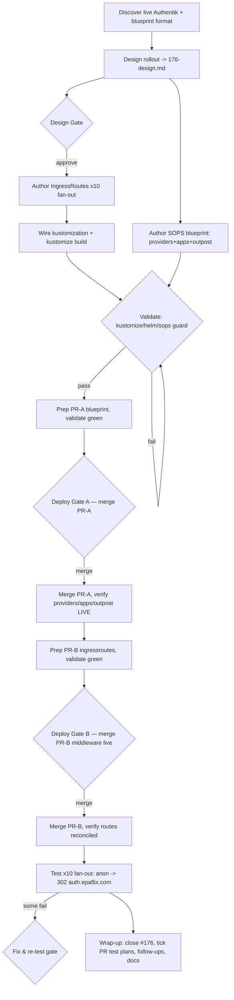

# Issue #176 — Servarr forward-auth rollout

Gate the 10 drifted, public, unauthenticated servarr UIs (sonarr, sonarr2, radarr,
prowlarr, bazarr, cleanuparr, homarr, lingarr, qbittorrent, wizarr) behind the
newtarr Authentik forward-auth pattern. jellyfin + seerr untouched. Full GitOps:
codify drift + middleware + declarative Authentik blueprint. Two-stage deploy with
human merge gates. All edits in an isolated worktree.

Key safety properties:
- Stage A (Authentik objects) is fully live + verified before Stage B (middleware) merges — prevents lockout/500.
- Outpost binding must preserve existing newtarr (pk 82) + traefik bindings — never clobber.
- Deploy/merge steps are `alwaysBreakOn` human gates (owner breakpointTolerance=low).
