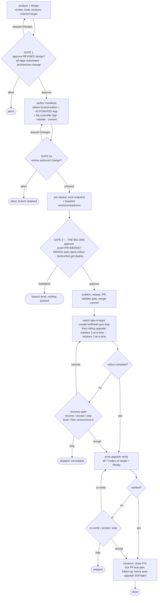

# system-upgrade Plans onboard (#74, ALL APPS AUTOMATED) — flow

**Owner revision:** ALL Apps automated (selfHeal) — no manual sync. The `system-upgrade-plans` App is automated AND the existing `system-upgrade-controller` App is flipped manual→automated in the same PR. **Therefore MERGE is the deploy** (selfHeal auto-applies Plans → upgrade fires). ONE hard deploy gate at merge, after an etcd snapshot. homarr is disposable.

**Gates:** G1 design (architecture-change), G2a authored-change review, G2 merge=live-rollout (destructive-git+deploy) + recovery/verify gates.
