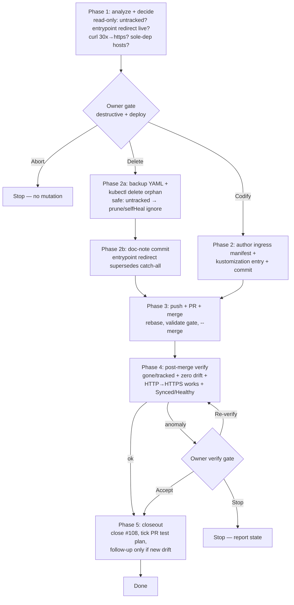

# traefik drift #108 — flow

```mermaid
flowchart TD
    A[Phase 1: analyze + decide<br/>read-only: untracked? entrypoint redirect live?<br/>curl 30x→https? sole-dep hosts?] --> G{Owner gate<br/>destructive + deploy}
    G -->|Abort| X[Stop — no mutation]
    G -->|Delete| D1[Phase 2a: backup YAML +<br/>kubectl delete orphan<br/>safe: untracked → prune/selfHeal ignore]
    G -->|Codify| C1[Phase 2: author ingress manifest +<br/>kustomization entry + commit]
    D1 --> D2[Phase 2b: doc-note commit<br/>entrypoint redirect supersedes catch-all]
    D2 --> P[Phase 3: push + PR + merge<br/>rebase, validate gate, --merge]
    C1 --> P
    P --> V[Phase 4: post-merge verify<br/>gone/tracked + zero drift +<br/>HTTP→HTTPS works + Synced/Healthy]
    V -->|ok| Z[Phase 5: closeout<br/>close #108, tick PR test plan,<br/>follow-up only if new drift]
    V -->|anomaly| R{Owner verify gate}
    R -->|Re-verify| V
    R -->|Accept| Z
    R -->|Stop| X2[Stop — report state]
    Z --> DONE[Done]
```
