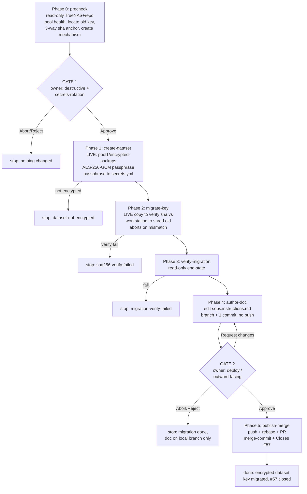

# Process — TrueNAS encrypted SOPS backups dataset (#57)

```mermaid
flowchart TD
    A[Phase 0: precheck<br/>read-only TrueNAS+repo<br/>pool health, locate old key,<br/>3-way sha anchor, create mechanism] --> G1{GATE 1<br/>owner: destructive +<br/>secrets-rotation}
    G1 -->|Abort/Reject| X1[stop: nothing changed]
    G1 -->|Approve| B[Phase 1: create-dataset<br/>LIVE: pool1/encrypted-backups<br/>AES-256-GCM passphrase<br/>passphrase to secrets.yml]
    B -->|not encrypted| X2[stop: dataset-not-encrypted]
    B --> C[Phase 2: migrate-key<br/>LIVE copy to verify sha vs<br/>workstation to shred old<br/>aborts on mismatch]
    C -->|verify fail| X3[stop: sha256-verify-failed]
    C --> D[Phase 3: verify-migration<br/>read-only end-state]
    D -->|fail| X4[stop: migration-verify-failed]
    D --> E[Phase 4: author-doc<br/>edit sops.instructions.md<br/>branch + 1 commit, no push]
    E --> G2{GATE 2<br/>owner: deploy /<br/>outward-facing}
    G2 -->|Request changes| E
    G2 -->|Abort/Reject| X5[stop: migration done,<br/>doc on local branch only]
    G2 -->|Approve| F[Phase 5: publish-merge<br/>push + rebase + PR<br/>merge-commit + Closes #57]
    F --> Z[done: encrypted dataset,<br/>key migrated, #57 closed]
```
